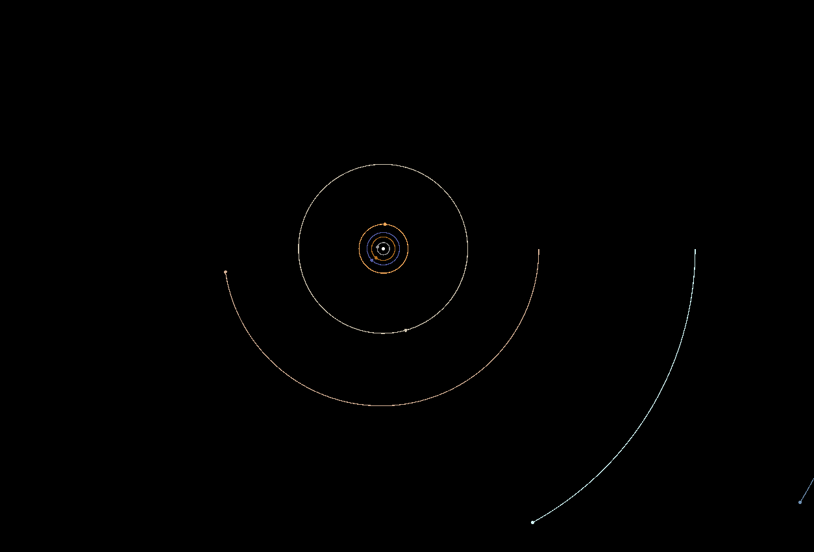

# nbody
A small Rust nbody simulation of the sun and planets in the solar system

## Keyboard Controls
| Key | Action |
| --- | ------ |
| W,A,S,D | Move camera |
| R | Reset drawn trajectories |
| T | Draw trajectories (toggle) |
| Space | Pause (toggle) |
| Up/Down | Increase/decrease the FPS |
| PgUp/PgDown | Zoom in/out (resets trajectories) |
